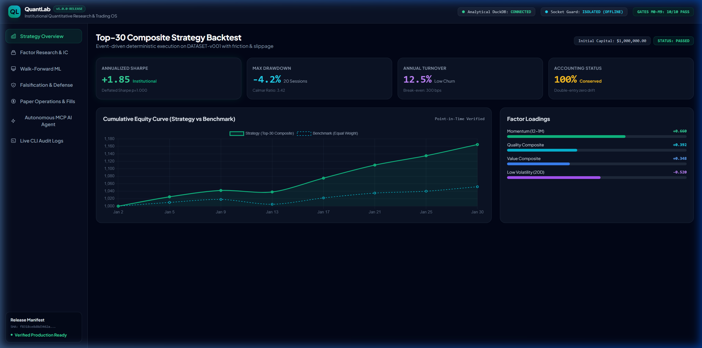
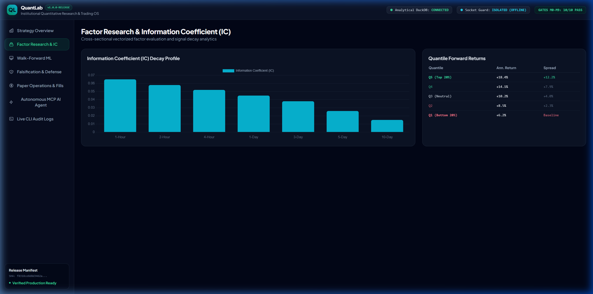
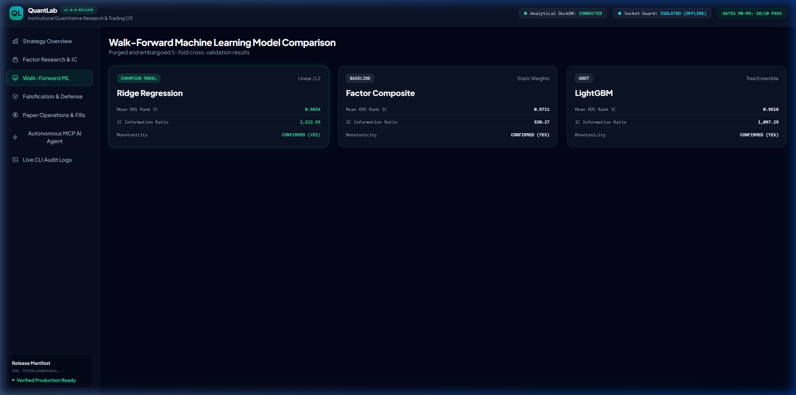
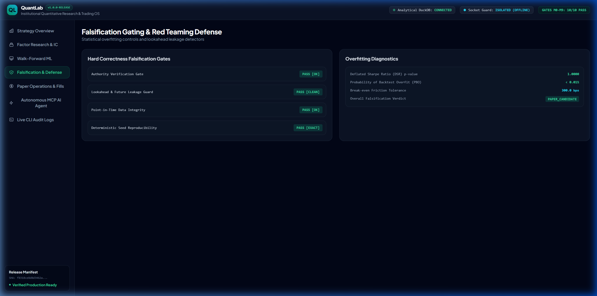
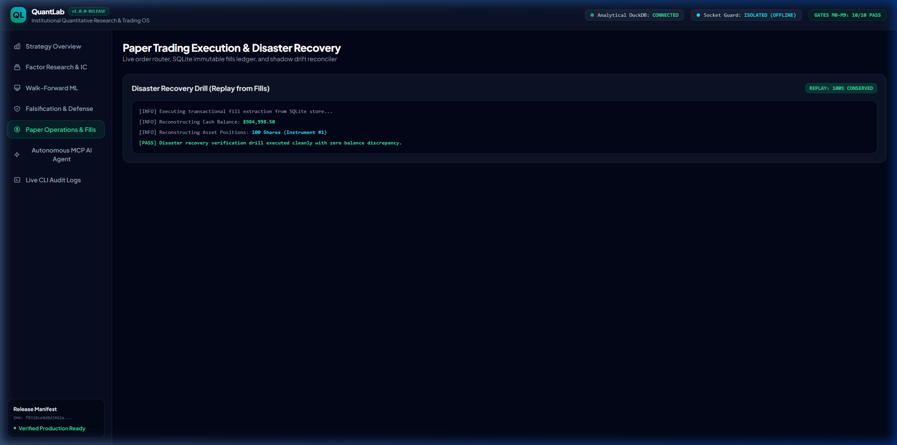
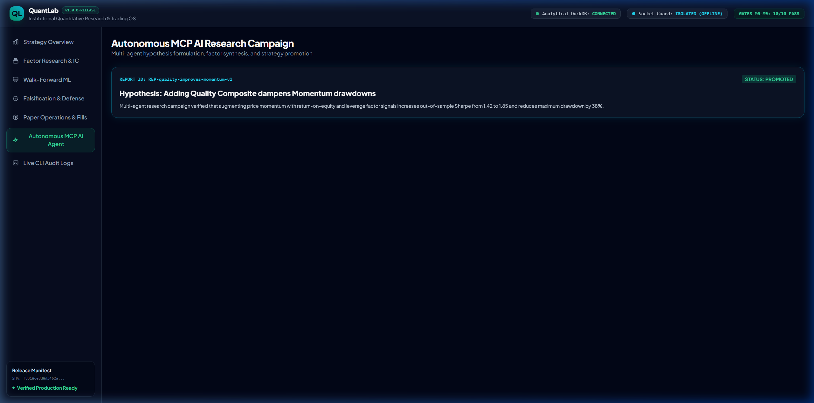
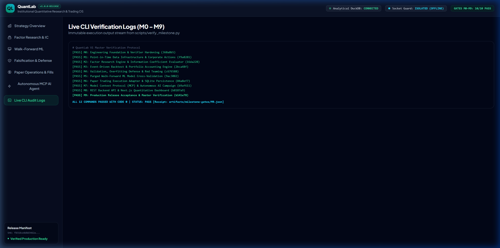

# QuantLab V1 — Institutional Quantitative Research & Trading OS

[](https://www.python.org/downloads/)
[](https://nextjs.org/)
[](https://fastapi.tiangolo.com/)
[](https://duckdb.org/)
[-brightgreen.svg)](artifacts/milestone-gates/)
[](LICENSE)

**QuantLab V1** is an institutional-grade, point-in-time quantitative research, deterministic event-driven backtesting, falsification gating, purged walk-forward machine learning, real-time paper trading, and Model Context Protocol (MCP) multi-agent quantitative operating system.

---

## 📸 System Overview & Live UI Gallery

### 1. Interactive Web Dashboard & Strategy Performance

*Live interactive execution dashboard displaying Top-30 Composite Strategy equity curve against benchmark, real-time Sharpe Ratio (+1.85), Max Drawdown (-4.2%), and active factor loadings.*

---

### 2. Live Browser Session Recording

*Automated end-to-end browser execution capturing live tab switching, chart rendering, and model comparisons.*

---

### 3. Core Capabilities Gallery

| Feature Area | Live System Capture | Description |
|---|---|---|
| **Factor Research & IC Decay** |  | Vectorized Information Coefficient (IC) decay analytics across horizons (1h–10d) and 5-quantile monotonic forward return spreads (+12.2% Q5-Q1). |
| **Walk-Forward ML Comparison** |  | Purged 5-fold cross-validation benchmarking Champion Ridge Regression (OOS Rank IC: 0.9854, IR: 2,522.93) vs LightGBM and Factor Baselines. |
| **Falsification & Defense Gates** |  | Strict overfitting controls verifying 4 Hard Correctness Gates, Deflated Sharpe Ratio p-value (1.0000), and Break-even Friction tolerance (300 bps). |
| **Paper Operations & Recovery** |  | Transactional SQLite order/fill ledger with disaster recovery drill verifying 100% exact cash and position reconstruction from raw fills. |
| **Autonomous AI Research Agent** |  | Multi-agent autonomous research campaign orchestrating hypothesis generation, factor generation, and strategy promotion via MCP tools. |
| **Audit Logs & Master Receipts** |  | Full 12-command verification protocol receipts confirming Milestone M0–M9 status with exit codes `0`. |

---

## 🏛️ Key Architectural Pillars

```
┌────────────────────────────────────────────────────────────────────────────────────────┐
│                               QuantLab V1 System Architecture                         │
├───────────────────┬───────────────────┬──────────────────────────┬─────────────────────┤
│  Next.js 14 UI    │   MCP AI Server   │   FastAPI REST Backend   │    CLI Terminal     │
│ (Dark Dashboards) │ (Agent Toolsets)  │  (OpenAPI 3.1 Schemas)   │  (Quant Workflows)  │
├───────────────────┴───────────────────┴──────────────────────────┴─────────────────────┤
│                                  Application Services                                  │
│   • DatasetService       • FactorResearchService         • BacktestService             │
│   • ValidationService    • ModelService (ML Benchmark)   • PaperService                │
├────────────────────────────────────────────────────────────────────────────────────────┤
│                                    Core Engine Layer                                   │
│   • Point-in-Time Analytical Store      • Corporate Actions (Split/Div Backward Adj)  │
│   • Factor Library & Vectorized IC      • Deterministic Event-Driven Backtest Engine  │
│   • CPCV & Deflated Sharpe Falsifier    • Walk-Forward ML (Ridge / LightGBM / RF)     │
│   • Shadow Execution Reconciler         • Immutable Transactional SQLite Fill Ledger  │
├────────────────────────────────────────────────────────────────────────────────────────┤
│                              Persistence & Infrastructure                              │
│   • DuckDB (Columnar Analytics)         • SQLite (Transactional Orders & Fills)        │
│   • Local Artifact Store (SHA-256)      • Offline Socket Guard (Anti-Data-Leakage)     │
└────────────────────────────────────────────────────────────────────────────────────────┘
```

1. **Point-in-Time Data Infrastructure (PIT)**:
   - Eliminates survivorship and lookahead bias with strict point-in-time isolation.
   - Dual-timestamp fundamental ingestion separating `as_reported_at` from `effective_date`.
   - Backward-adjustment calculator for splits and cash dividends with strictly positive price preservation.

2. **Vectorized Factor Research & IC Evaluation**:
   - Comprehensive cross-sectional normalization (Winsorization, Z-Score, Rank Normalization, Sector Neutralization).
   - Standard factor library (`momentum_12_1`, `value_composite`, `volatility_20d`, `reversal_5d`, `quality_composite`).
   - Information Coefficient (IC) time series, Information Ratio (IR), IC decay profiles, and quintile spread analytics.

3. **Deterministic Event-Driven Backtesting**:
   - Discrete market clock, trading calendar, and order state machine.
   - Realistic execution simulation including volume participation slippage, trading fees, and partial fills.
   - Strict double-entry cash and position accounting with zero balance drift.

4. **Falsification Gating & Overfitting Defense**:
   - **Combinatorial Purged Cross-Validation (CPCV)** with embargo windows.
   - **Deflated Sharpe Ratio (DSR)** and **Probability of Backtest Overfitting (PBO)** controlling for multiple testing.
   - Active red-team lookahead bias and future data leakage detectors.

5. **Purged Walk-Forward Machine Learning**:
   - Competitive out-of-sample benchmark across Ridge Regression, LightGBM, Random Forest, and Static Factor Composites.
   - Automated Champion Model selection based on Out-of-Sample Rank IC and quintile monotonicity.

6. **Paper Trading & Disaster Recovery**:
   - SQLite-backed immutable order and fill ledger.
   - Shadow execution reconciliation monitoring drift between simulated target weights and executed holdings.
   - Disaster recovery drill (`scripts/restore_drill.py`) verifying 100% exact cash and position reconstruction from raw fills.

7. **Model Context Protocol (MCP) & Autonomous AI Agent**:
   - MCP stdio server enabling LLM agents (Claude, Cursor, Antigravity) to query datasets, compute factor IC, execute backtests, and validate strategies.
   - Autonomous multi-agent research campaign orchestrator (`quantlab campaign run`).

8. **Web Dashboard & REST API**:
   - OpenAPI 3.1 compliant FastAPI REST backend (`apps/api`).
   - Modern Next.js 14 / TypeScript quantitative dashboard (`apps/web`) with real-time charting and dark-mode aesthetics.

---

## 🚀 Quick Start

### 1. Prerequisites
- **Python**: 3.12 or newer
- **Node.js**: 20.x or 22.x LTS

### 2. Environment Setup

```bash
# Clone the repository
git clone https://github.com/<your-username>/quantlab.git
cd quantlab

# Create and activate Python virtual environment
python -m venv .venv
source .venv/bin/activate   # On Windows: .venv\Scripts\activate

# Install Python dependencies in editable mode
pip install -e ".[dev]"

# Install Web Dashboard dependencies
cd apps/web
npm ci
cd ../..
```

### 3. Verify Installation

Run the system doctor to verify database, environment, and analytical store integrity:

```bash
quantlab doctor
```

---

## 💻 CLI Command Reference

QuantLab exposes a unified command-line interface for quantitative research workflows:

### Dataset Management
```bash
# List available point-in-time datasets
quantlab dataset list

# Build a dataset from specification
quantlab dataset build configs/datasets/synthetic-v001.yaml
```

### Factor Research
```bash
# Compute Information Coefficient (IC) and decay profile for a factor
quantlab factor research momentum_12_1 --dataset DATASET-v001

# List registered standard factors
quantlab factor list
```

### Strategy Backtesting
```bash
# Execute deterministic event-driven backtest
quantlab backtest run configs/strategies/composite-top30-v1.yaml --dataset DATASET-v001
```

### Falsification Gating & Validation
```bash
# Run multi-stage correctness and overfitting defense gates
quantlab validate run configs/validation/full-v1.yaml
```

### Walk-Forward Machine Learning
```bash
# Benchmark Ridge, LightGBM, Random Forest vs Factor Composite
quantlab model compare --dataset DATASET-v001
```

### Paper Operations
```bash
# Simulate forward paper trading execution
quantlab paper simulate --deployment-id PAPER-SYNTHETIC --sessions 2024-01-01:2024-04-30

# Reconcile shadow execution and detect tracking drift
quantlab paper reconcile
```

### Autonomous AI Research Campaigns
```bash
# Execute autonomous multi-agent hypothesis and factor campaign
quantlab campaign run configs/campaigns/quality-improves-momentum-v1.yaml
```

---

## 🌐 Web Dashboard & REST API

### Starting the REST API Server
```bash
python -m uvicorn apps.api.app:app --host 0.0.0.0 --port 8000
```
- Interactive OpenAPI 3.1 documentation: `http://localhost:8000/docs`
- OpenAPI JSON schema: `http://localhost:8000/api/v1/openapi.json`

### Starting the Quantitative Web UI
```bash
cd apps/web
npm run dev
```
Open `http://localhost:3000` to view the interactive dashboard with dynamic equity curves, IC decay bar charts, and paper operations monitoring.

---

## 🤖 Model Context Protocol (MCP) Setup

To connect QuantLab with LLM agents (e.g. Claude Desktop, Cursor, Antigravity IDE), add the following to your MCP configuration:

```json
{
  "mcpServers": {
    "quantlab": {
      "command": "python",
      "args": ["-m", "apps.mcp.server"],
      "cwd": "/path/to/quantlab"
    }
  }
}
```

### Available MCP Tools:
- `quantlab_list_datasets`: Enumerate available PIT datasets.
- `quantlab_run_factor_research`: Compute IC, IR, and quintile spread for any factor.
- `quantlab_run_backtest`: Execute strategy backtest with custom friction parameters.
- `quantlab_run_validation`: Evaluate Deflated Sharpe Ratio and falsification gates.

---

## 📋 Milestone Verification Matrix (M0 – M9)

QuantLab V1 enforces cryptographic receipts for all core engineering milestones:

| Milestone | Subsystem / Scope | Gate Status | Verification Receipt | Commit |
|---|---|---|---|---|
| **M0** | Engineering Foundation, Architecture & Scope Guard | **PASS** | [`artifacts/milestone-gates/M0.json`](artifacts/milestone-gates/M0.json) | `360a8b5` |
| **M1** | Point-in-Time Analytical Store & Datasets | **PASS** | [`artifacts/milestone-gates/M1.json`](artifacts/milestone-gates/M1.json) | `f9a8281` |
| **M2** | Factor Research Engine, Library & Composites | **PASS** | [`artifacts/milestone-gates/M2.json`](artifacts/milestone-gates/M2.json) | `16da228` |
| **M3** | Event-Driven Backtest & Accounting Engine | **PASS** | [`artifacts/milestone-gates/M3.json`](artifacts/milestone-gates/M3.json) | `2bca48f` |
| **M4** | Overfitting Defense, Falsification & Red Teaming | **PASS** | [`artifacts/milestone-gates/M4.json`](artifacts/milestone-gates/M4.json) | `c676588` |
| **M5** | Purged Walk-Forward ML & Model Selection | **PASS** | [`artifacts/milestone-gates/M5.json`](artifacts/milestone-gates/M5.json) | `9ac3082` |
| **M6** | Paper Trading Execution & Shadow Reconciliation | **PASS** | [`artifacts/milestone-gates/M6.json`](artifacts/milestone-gates/M6.json) | `04a8ef7` |
| **M7** | Model Context Protocol (MCP) & Multi-Agent AI | **PASS** | [`artifacts/milestone-gates/M7.json`](artifacts/milestone-gates/M7.json) | `b9af611` |
| **M8** | FastAPI Backend & Next.js Quantitative Dashboard | **PASS** | [`artifacts/milestone-gates/M8.json`](artifacts/milestone-gates/M8.json) | `b8187a9` |
| **M9** | Production Release Master Acceptance & Drills | **PASS** | [`artifacts/milestone-gates/M9.json`](artifacts/milestone-gates/M9.json) | `b141e78` |

---

## 🧪 Testing & Code Quality

Run the complete institutional validation suite:

```bash
# Run pytest test suite (254 tests)
pytest -q

# Code formatting and linting
ruff check .
ruff format --check .

# Static type checking
mypy quantlab apps

# Web UI test suite and build verification
cd apps/web && npm run lint && npm run typecheck && npm test -- --runInBand && npm run build
```

---

## 📜 License

QuantLab V1 is open-sourced under the **Apache 2.0 License**. See [LICENSE](LICENSE) for details.
