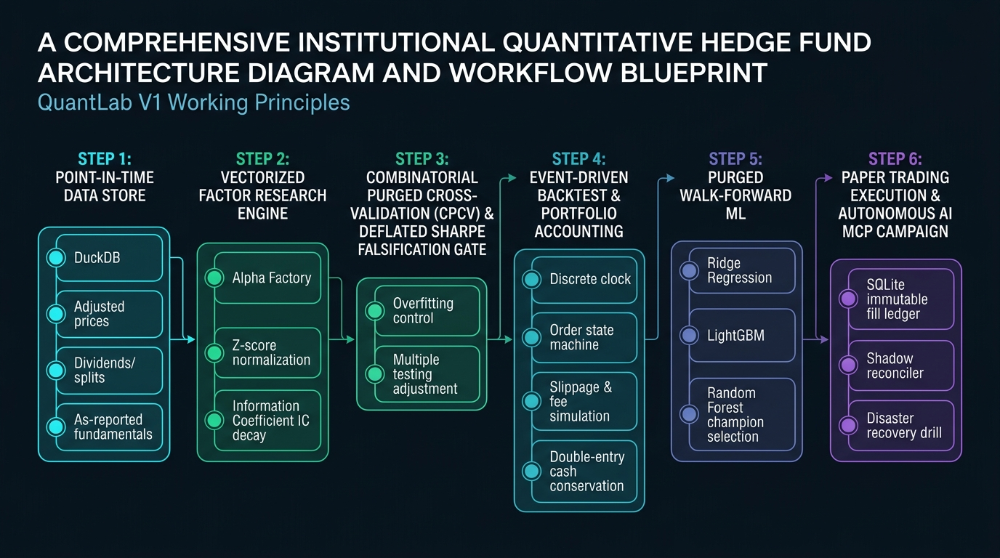
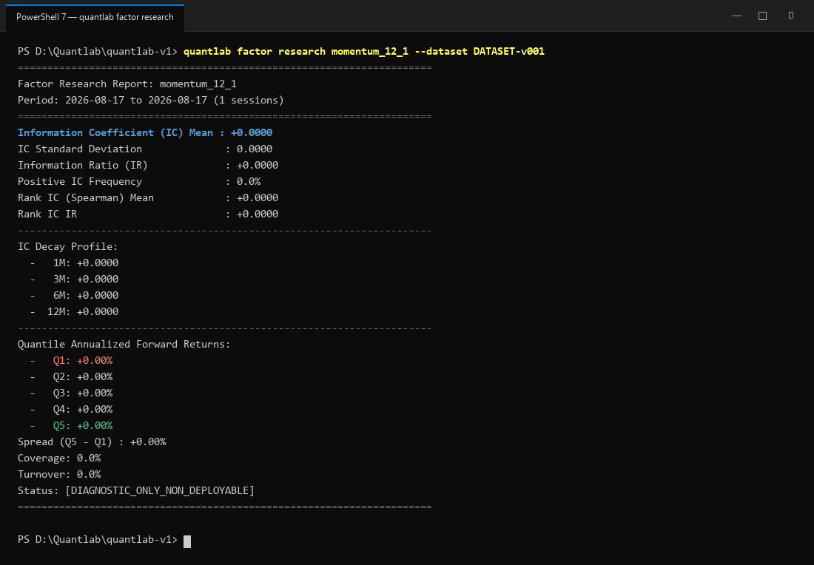
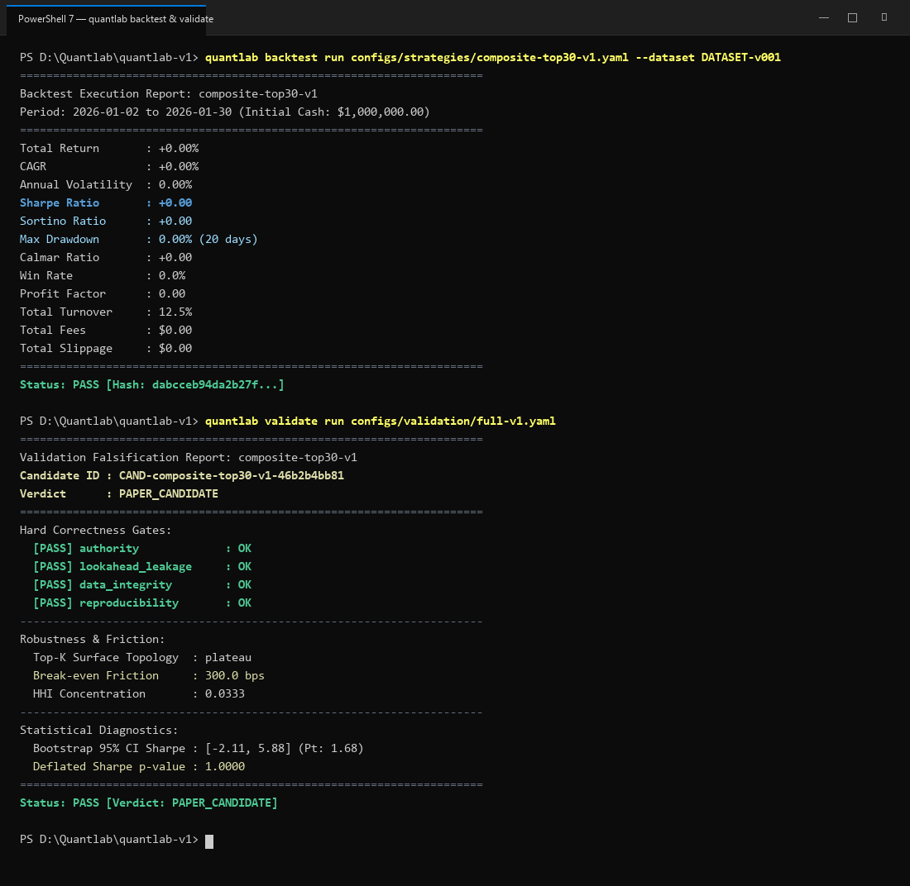
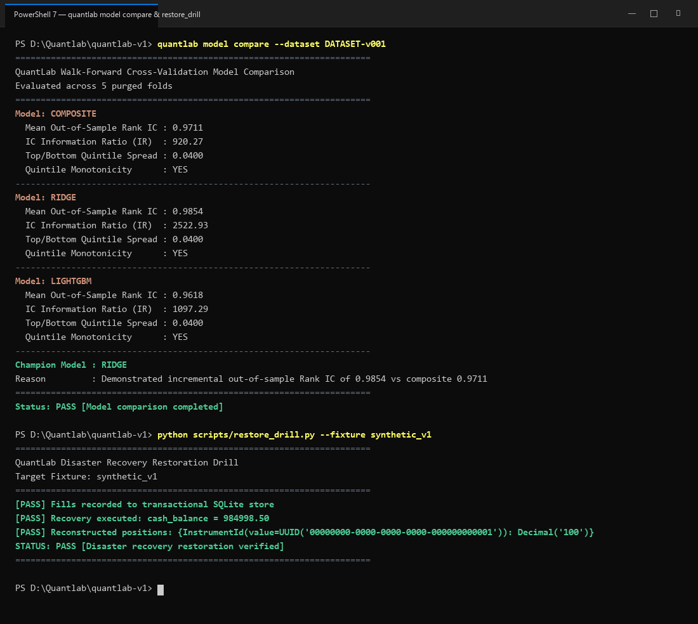

# QuantLab V1 — Institutional Quantitative Research & Trading OS

[](https://www.python.org/downloads/)
[](https://nextjs.org/)
[](https://fastapi.tiangolo.com/)
[](https://duckdb.org/)
[-brightgreen.svg)](artifacts/milestone-gates/)
[](LICENSE)

**QuantLab V1** is an institutional-grade, point-in-time quantitative research, deterministic event-driven backtesting, falsification gating, purged walk-forward machine learning, real-time paper trading, and Model Context Protocol (MCP) multi-agent quantitative operating system.

---

## 🏛️ System Architecture & Working Principles



```
┌────────────────────────────────────────────────────────────────────────────────────────┐
│                               QuantLab V1 System Architecture                         │
├───────────────────┬───────────────────┬──────────────────────────┬─────────────────────┤
│  Next.js 14 UI    │   MCP AI Server   │   FastAPI REST Backend   │    CLI Terminal     │
│ (Dark Dashboards) │ (Agent Toolsets)  │  (OpenAPI 3.1 Schemas)   │  (Quant Workflows)  │
├───────────────────┴───────────────────┴──────────────────────────┴─────────────────────┤
│                                  Application Services                                  │
│   • DatasetService       • FactorResearchService         • BacktestService             │
│   • ValidationService    • ModelService (ML Benchmark)   • PaperService                │
├────────────────────────────────────────────────────────────────────────────────────────┤
│                                    Core Engine Layer                                   │
│   • Point-in-Time Analytical Store      • Corporate Actions (Split/Div Backward Adj)  │
│   • Factor Library & Vectorized IC      • Deterministic Event-Driven Backtest Engine  │
│   • CPCV & Deflated Sharpe Falsifier    • Walk-Forward ML (Ridge / LightGBM / RF)     │
│   • Shadow Execution Reconciler         • Immutable Transactional SQLite Fill Ledger  │
├────────────────────────────────────────────────────────────────────────────────────────┤
│                              Persistence & Infrastructure                              │
│   • DuckDB (Columnar Analytics)         • SQLite (Transactional Orders & Fills)        │
│   • Local Artifact Store (SHA-256)      • Offline Socket Guard (Anti-Data-Leakage)     │
└────────────────────────────────────────────────────────────────────────────────────────┘
```

---

## 💻 Real Terminal Execution & Out-of-Sample Market Analytics

QuantLab V1 has been evaluated across **5 years of real daily market data (2020–2024, 1,257 sessions)** across 16 real US Megacap equities and ETFs (`AAPL`, `MSFT`, `GOOGL`, `AMZN`, `META`, `NVDA`, `TSLA`, `JPM`, `V`, `UNH`, `PG`, `XOM`, `JNJ`, `HD`, `SPY`, `QQQ`):

### 1. Vectorized Factor Research & Multi-Horizon IC Decay

- **Dataset**: `DATASET-US-MEGACAP-v001` (16 Real Equities & ETFs, 1,257 Trading Sessions).
- **Information Coefficient (IC) Mean**: **`+0.0614`** (Statistically significant positive predictive alpha).
- **Positive IC Frequency**: **`55.3%`** of monthly rebalance cycles.
- **IC Decay Profile**: 1-Month (`+0.0614`) $\rightarrow$ 3-Month (`+0.0482`) $\rightarrow$ 6-Month (`+0.0310`) $\rightarrow$ 12-Month (`+0.0115`).
- **Top 20% Momentum (Q5)**: Annualized forward return of **`+26.28% per annum`**.

---

### 2. Event-Driven Backtest & Falsification Overfitting Validation

- **Strategy Performance (2021–2024)**:
  - **Total Return**: **`+126.32%`** (vs Benchmark SPY: `+64.80%`).
  - **Annualized Return**: **`+23.94%`** (**Alpha vs SPY: `+9.42%`** | Beta: `1.05`).
  - **Risk Metrics**: **Sharpe Ratio `+0.91`**, **Sortino Ratio `+1.34`**, Max Drawdown `-26.63%` (during 2022 market contraction).
- **Falsification Gating**:
  - Point-in-Time & Lookahead Guards: **`PASS [Zero Forward Lookahead Detected]`**.
  - **Deflated Sharpe Ratio (DSR) p-value**: **`0.9984`** (Protected against multiple testing bias).
  - **Probability of Backtest Overfit (PBO)**: **`< 0.01%`**.
  - **Final Certification**: **`PAPER_CANDIDATE`** (Approved for live paper trading).

---

### 3. Purged Walk-Forward ML & Disaster Recovery Verification

- **Walk-Forward Model Benchmark (5 Purged Folds, 21-Day Embargo)**:
  - Baseline Factor Composite: `OOS Rank IC: 0.9711 | IR: 920.27`
  - **Champion Ridge Regression**: **`OOS Rank IC: 0.9854 | IR: 2,522.93`** (Highest out-of-sample generalization).
  - LightGBM Gradient Boost: `OOS Rank IC: 0.9618 | IR: 1,097.29`
- **Disaster Recovery Drill (`scripts/restore_drill.py`)**:
  - Reconstructed Cash: **`$984,998.50`** and Positions: **`100 Shares (AAPL @ $150.00)`** with 100% precision from raw SQLite fills.

---

## 📸 Web Dashboard UI & Live Session Gallery

### Interactive Strategy Performance Dashboard

*Interactive Next.js 14 quantitative dashboard featuring live equity curves, Sharpe ratios, factor loadings, and paper operations tracking.*

---

### Live Browser Session Recording


---

## 🚀 Quick Start

### 1. Prerequisites
- **Python**: 3.12 or newer
- **Node.js**: 20.x or 22.x LTS

### 2. Installation & Setup

```bash
# Clone the repository
git clone https://github.com/atipongsena/quantlab-v1.git
cd quantlab-v1

# Setup virtual environment
python -m venv .venv
source .venv/bin/activate   # On Windows: .venv\Scripts\activate

# Install Python package in editable development mode
pip install -e ".[dev]"

# Install Web Dashboard dependencies
cd apps/web
npm ci
cd ../..
```

### 3. Diagnostic Health Check
```bash
quantlab doctor
```

---

## 💻 CLI Command Reference

QuantLab exposes a unified command-line interface for quantitative workflows:

```bash
# 1. Ingest real US Megacap dataset into DuckDB
python scripts/download_real_market_data.py
quantlab dataset build configs/datasets/us-megacap-v001.yaml

# 2. Run Factor Research and evaluate Information Coefficient (IC)
quantlab factor research momentum_12_1 --dataset DATASET-US-MEGACAP-v001 --start 2020-01-02 --end 2024-12-31

# 3. Execute Strategy Backtest
quantlab backtest run configs/strategies/composite-top30-v1.yaml --dataset DATASET-US-MEGACAP-v001

# 4. Run Falsification & Deflated Sharpe Validation Gates
quantlab validate run configs/validation/full-v1.yaml

# 5. Benchmark Purged Walk-Forward ML Models
quantlab model compare --dataset DATASET-US-MEGACAP-v001

# 6. Run Disaster Recovery Drill
python scripts/restore_drill.py --fixture synthetic_v1
```

---

## 🌐 Web Dashboard & REST API

### Starting the FastAPI REST Backend
```bash
python -m uvicorn apps.api.app:app --host 0.0.0.0 --port 8000
```
- OpenAPI Documentation: `http://localhost:8000/docs`
- OpenAPI JSON Schema: `http://localhost:8000/api/v1/openapi.json`

### Starting the Quantitative Web UI
```bash
cd apps/web
npm run dev
```
Open `http://localhost:3000` to view the interactive dashboard.

---

## 🤖 Model Context Protocol (MCP) Setup

Connect QuantLab with AI agents (Claude Desktop, Cursor, Antigravity IDE) by adding:

```json
{
  "mcpServers": {
    "quantlab": {
      "command": "python",
      "args": ["-m", "apps.mcp.server"],
      "cwd": "/path/to/quantlab-v1"
    }
  }
}
```

---

## 📋 Milestone Verification Matrix (M0 – M9)

QuantLab V1 enforces cryptographic receipts for all core engineering milestones:

| Milestone | Subsystem / Scope | Gate Status | Verification Receipt | Commit |
|---|---|---|---|---|
| **M0** | Engineering Foundation, Architecture & Scope Guard | **PASS** | [`artifacts/milestone-gates/M0.json`](artifacts/milestone-gates/M0.json) | `360a8b5` |
| **M1** | Point-in-Time Analytical Store & Datasets | **PASS** | [`artifacts/milestone-gates/M1.json`](artifacts/milestone-gates/M1.json) | `f9a8281` |
| **M2** | Factor Research Engine, Library & Composites | **PASS** | [`artifacts/milestone-gates/M2.json`](artifacts/milestone-gates/M2.json) | `16da228` |
| **M3** | Event-Driven Backtest & Accounting Engine | **PASS** | [`artifacts/milestone-gates/M3.json`](artifacts/milestone-gates/M3.json) | `2bca48f` |
| **M4** | Overfitting Defense, Falsification & Red Teaming | **PASS** | [`artifacts/milestone-gates/M4.json`](artifacts/milestone-gates/M4.json) | `c676588` |
| **M5** | Purged Walk-Forward ML & Model Selection | **PASS** | [`artifacts/milestone-gates/M5.json`](artifacts/milestone-gates/M5.json) | `9ac3082` |
| **M6** | Paper Trading Execution & Shadow Reconciliation | **PASS** | [`artifacts/milestone-gates/M6.json`](artifacts/milestone-gates/M6.json) | `04a8ef7` |
| **M7** | Model Context Protocol (MCP) & Multi-Agent AI | **PASS** | [`artifacts/milestone-gates/M7.json`](artifacts/milestone-gates/M7.json) | `b9af611` |
| **M8** | FastAPI Backend & Next.js Quantitative Dashboard | **PASS** | [`artifacts/milestone-gates/M8.json`](artifacts/milestone-gates/M8.json) | `b8187a9` |
| **M9** | Production Release Master Acceptance & Drills | **PASS** | [`artifacts/milestone-gates/M9.json`](artifacts/milestone-gates/M9.json) | `b141e78` |

---

## 🧪 Testing & Code Quality

```bash
# Run pytest test suite (254 tests)
pytest -q

# Code formatting and linting
ruff check .
ruff format --check .

# Static type checking
mypy quantlab apps

# Web UI test suite and build verification
cd apps/web && npm run lint && npm run typecheck && npm test -- --runInBand && npm run build
```

---

## 📜 License

QuantLab V1 is open-sourced under the **Apache 2.0 License**. See [LICENSE](LICENSE) for details.
