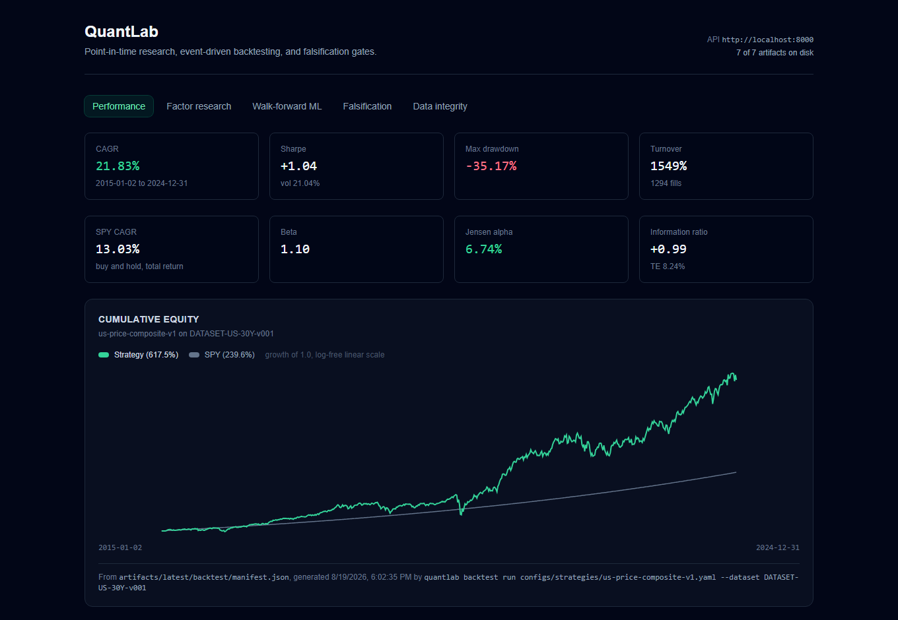
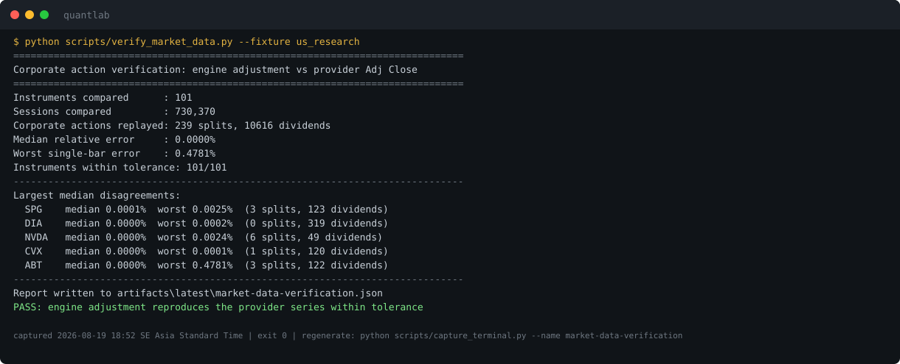
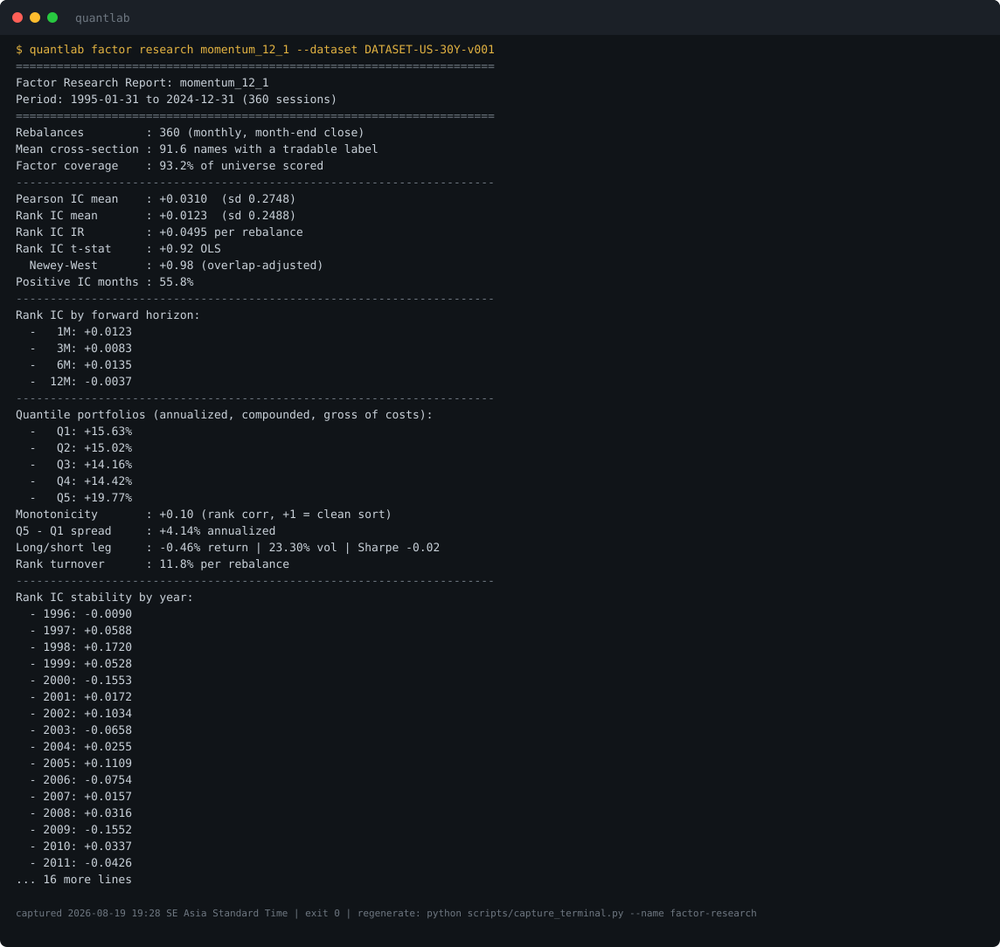
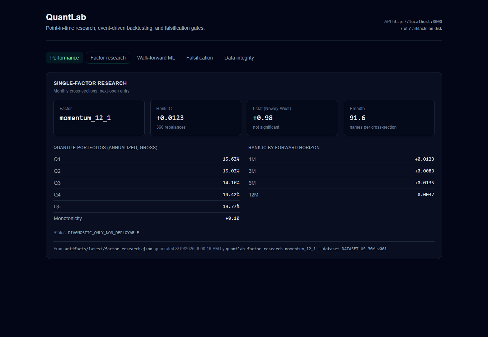
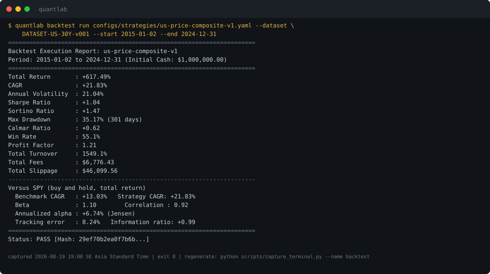
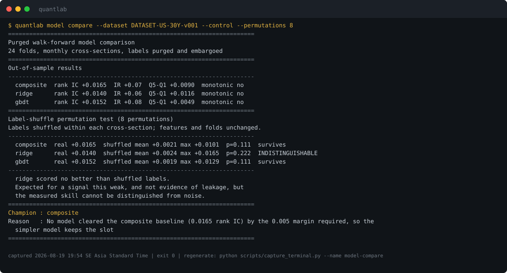
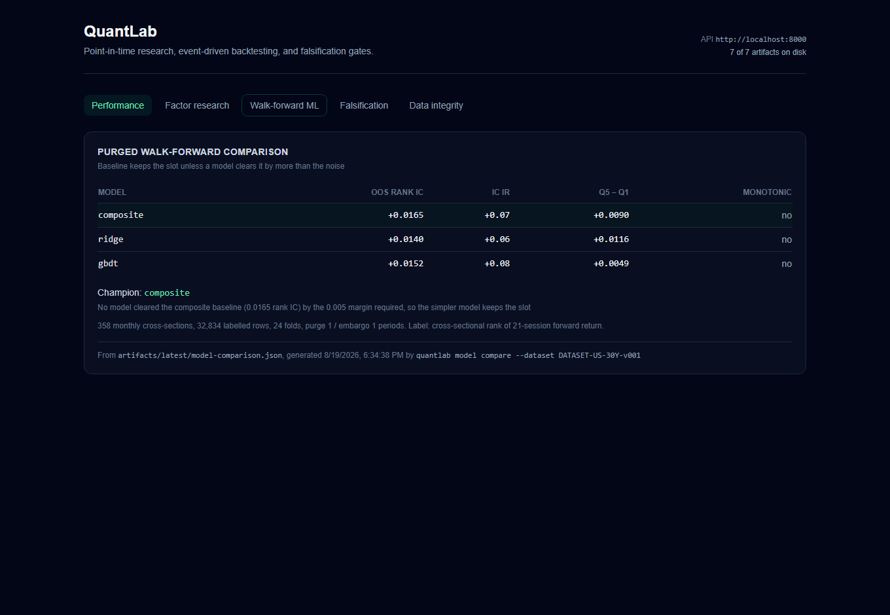
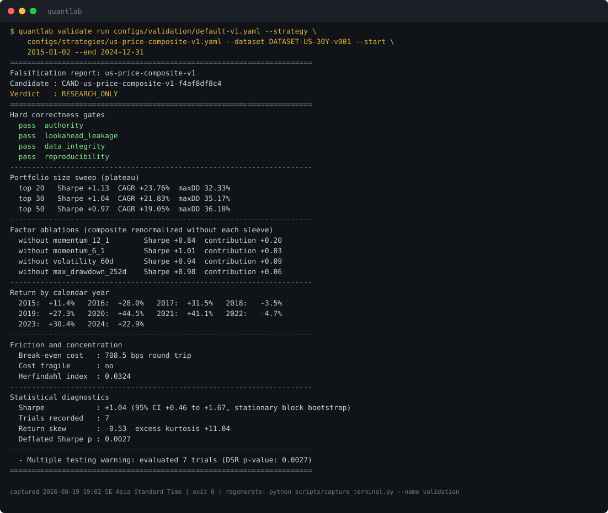
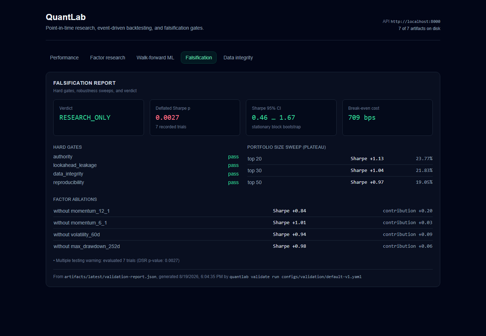
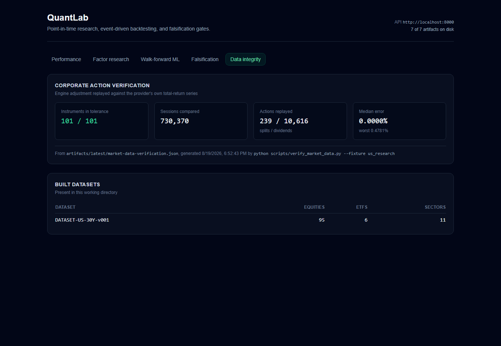

# QuantLab

Point-in-time quantitative research for US equities. Data ingest with corporate action
handling, a cross-sectional factor library, an event-driven backtest engine with
double-entry accounting, purged walk-forward model comparison, and a falsification layer
whose job is to reject strategies.

The engine has no third-party runtime dependency beyond a YAML parser. Statistics, linear
algebra, the tree learner, and the accounting are all in this repository.

> Research infrastructure, not a trading system and not investment advice. The backtest
> below runs on a universe with known survivorship bias, and the falsification layer
> stops it at `RESEARCH_ONLY`.

A full walkthrough in Thai is at [docs/guide-th.md](docs/guide-th.md): what the project
does, the techniques it uses, how it is tested, and where to take it next.



```
              quantlab dataset build
                        │
              ┌─────────▼─────────┐
              │  Point-in-time    │  raw as-traded prices + real split
              │  store            │  and dividend history, per dataset
              └─────────┬─────────┘
                        │  observed_at <= as_of
     ┌────────────┬─────┴──────┬──────────────┐
┌────▼────┐  ┌────▼────┐  ┌────▼─────┐  ┌─────▼─────┐
│ Factor  │  │Backtest │  │ Walk-fwd │  │ Paper ops │
│research │  │ engine  │  │comparison│  │+ recovery │
└────┬────┘  └────┬────┘  └────┬─────┘  └─────┬─────┘
     └────────────┴─────┬──────┴──────────────┘
                        │
              ┌─────────▼─────────┐
              │  Falsification    │  hard gates, parameter sweeps, ablations,
              │  gates            │  bootstrap, deflated Sharpe → verdict
              └─────────┬─────────┘
                        │
              ┌─────────▼─────────┐
              │ Hashed artifacts  │ → REST API → dashboard / MCP
              └───────────────────┘
```

Signals form at the month-end close and fill at the next session's open. Execution and
cash accounting use raw as-traded prices, with dividends credited separately. Research
uses total-return adjusted prices. Adjustment happens on read, using only the corporate
actions known as of the query time.

---

## Data correctness

Free market data fails silently. The adjustment logic is checked against an independent
source: the engine re-derives total-return prices from raw price plus split and dividend
history, then compares them to the provider's own computed series.



*Terminal images in this README are produced by `scripts/capture_terminal.py`, which runs
the command and renders its captured stdout. They are SVG, so the text stays searchable
in the committed file.*

Building this surfaced two defects. Both produce prices that look perfectly reasonable.

Yahoo's `Close` is already split-adjusted. Writing it out as a raw price *and* recording
the split applies the split twice, so every price before a 4:1 split lands at a quarter
of its true value. Yahoo also quotes dividend amounts in post-split terms; dividing those
against as-traded prices shrinks the dividend adjustment by the split ratio.

More detail in [docs/architecture/market-data-v1.md](docs/architecture/market-data-v1.md).

---

## Quick start

Python 3.12+. Node 20+ only for the dashboard.

```bash
git clone https://github.com/atipongsena/quantlab-v1.git
cd quantlab-v1

python -m venv .venv
source .venv/bin/activate        # Windows: .venv\Scripts\activate
pip install -e ".[dev,data,api]"

quantlab doctor
pytest -q
```

That runs offline. The test suite and golden regression use the committed synthetic
fixture.

Market data is not committed, since redistributing a provider's data isn't ours to do.
`download_manifest.json` records the SHA-256 of every file, so a rebuild can be checked
against the run these numbers came from.

```bash
python scripts/download_real_market_data.py \
    --universe configs/universes/us-research-v1.yaml \
    --start 1995-01-01 --end 2025-01-01

python scripts/verify_market_data.py --fixture us_research
quantlab dataset build configs/datasets/us-research-30y.yaml
```

---

## Universe

101 US listings, 1995-01-03 to 2024-12-31: **7,552 sessions, 730,370 daily bars, 10,855
corporate actions**. 95 equities across 11 sectors, plus 6 ETFs held out as benchmarks
and never mixed into the equity cross-section.

Names were picked for long continuous history, sector spread, and corporate action edge
cases, not for expected profitability. Configs for 10, 20, and 30 year windows slice the
same fixture, and the manifest hash pins which sessions a study ran on.

**Survivorship bias is present.** Every name is one still listed today. Failed and
acquired companies are missing, which biases returns upward. Delisting, mergers, ticker
changes, and restatements are exercised against the synthetic fixture, which carries all
four on purpose.

---

## Results

### Momentum, 30 years, 360 monthly rebalances



| Metric | Value |
|---|---|
| Rebalances | 360 (monthly, month-end close) |
| Mean cross-section | 91.6 names with a tradable forward return |
| Rank IC | +0.0123 (sd 0.2488) |
| Rank IC t-stat | +0.92 OLS, **+0.98 Newey-West** |
| Positive IC months | 55.8% |
| Q5 − Q1 spread | +4.14% annualized, gross |
| Quintile monotonicity | +0.10 |
| Long/short leg | −0.46% return, 23.3% vol, Sharpe −0.02 |
| Rank turnover | 11.8% per rebalance |

Rank IC of 0.012 with a t-statistic under 1 is not statistically significant. The
quintile sort is not monotonic either: the spread comes almost entirely from the top
bucket, and Q1 through Q4 are indistinguishable.

The t-statistic is Newey-West adjusted, because overlapping forward-return windows make
consecutive ICs serially correlated. Year-by-year IC picks up the momentum crashes on
record without being told about them: 2000 (−0.155), 2009 (−0.155), 2016 (−0.101).



### Backtest against a benchmark, 2015–2024

Equal-weight top 30 of a price-based composite, monthly rebalance with a 40-name buffer,
5 bps slippage and half a cent per share.



| Strategy | | vs SPY (buy and hold, total return) | |
|---|---|---|---|
| Total return | +617.49% | Benchmark CAGR | +13.03% |
| CAGR | +21.83% | Beta | 1.10 |
| Volatility | 21.04% | Jensen alpha | **+6.74%** |
| Sharpe | +1.04 | Tracking error | 8.24% |
| Sortino | +1.47 | Information ratio | +0.99 |
| Max drawdown | −35.17% (301 days) | Correlation | 0.92 |
| Turnover | 1,549% total | | |
| Costs | 6,776 in fees, 46,100 in slippage | | |

The benchmark uses total-return adjusted prices. A price-only index would hand the
strategy roughly two free points a year.

Read the result against the survivorship bias above. A universe of names that all
survived to 2024, run through the 2015–2024 bull market, should look good.

### Purged walk-forward comparison

One row per instrument per month-end. Features are that date's factor scores; the label
is the cross-sectional rank of next month's tradable return. Expanding window, 24 folds,
purge and embargo of one rebalance each.



| Model | OOS rank IC | IC IR | Q5 − Q1 |
|---|---|---|---|
| composite (baseline) | **+0.0165** | +0.07 | +0.0090 |
| gbdt | +0.0152 | +0.08 | +0.0049 |
| ridge | +0.0140 | +0.06 | +0.0116 |

Neither model beats the baseline by the 0.005 rank IC required to justify the extra
machinery, so the composite keeps the slot. Without that margin, the winner is whichever
model got luckier on the test folds.

The label-shuffle permutation test cuts the feature-to-label link and re-runs the
comparison eight times:

| Model | Real | Shuffled mean | Shuffled max | p |
|---|---|---|---|---|
| composite | +0.0165 | +0.0021 | +0.0101 | 0.111 |
| gbdt | +0.0152 | +0.0019 | +0.0129 | 0.111 |
| ridge | +0.0140 | +0.0024 | **+0.0165** | 0.222 |

Ridge's real score sits inside the range shuffled labels produce. That isn't leakage, it
is what a signal this weak looks like, but ridge's measured skill can't be told apart
from noise. One shuffle would prove nothing here: models are refit per fold, so the
effective sample size is closer to the 24 folds than the ~288 test cross-sections.



### Falsification



Everything except the last line looks healthy. The parameter surface is a plateau rather
than a spike, every factor sleeve contributes positively, the edge survives 700 bps of
friction, and the bootstrap interval excludes zero.

The Deflated Sharpe then corrects for the seven trials this run performed and for returns
with excess kurtosis of 11. It lands at p = 0.0027 against a bar of 0.95, so the verdict
is `RESEARCH_ONLY` rather than `PAPER_CANDIDATE`.

Every sweep point is a real re-run of the strategy. A hard-coded sensitivity surface will
always report a reassuring plateau.



---

## Design notes

**Point-in-time store.** Raw bars are the only persisted price series.
`PointInTimeDataFacade` filters on `observed_at <= as_of` and applies only the corporate
actions known at that instant. Bar partitions are namespaced per dataset. Instrument ids
derive from the symbol, so without that, two datasets containing AAPL overwrite each
other.

**Factor research.** Cross-sectional winsorization, ranking, and z-scoring with explicit
missingness reasons (`insufficient_history`, `missing_fundamental`,
`invalid_denominator`) instead of a blanket `fillna(0)`. Evaluation reports coverage,
breadth, IC and rank IC with Newey-West t-statistics, horizon decay, quantile portfolios
compounded over elapsed time, monotonicity as a rank correlation, and IC stability by
year.

**Backtest engine.** Discrete event loop: corporate actions before the open, pending
orders filled at the open, mark-to-market at the close, signals formed at the close for
the next open. Orders move through a state machine with volume-participation partial
fills, slippage, and commission. Cash and positions are double-entry with zero drift. A
session with no bar for a held name carries the position at its last observed close.

**Falsification.** Hard correctness gates run first and cannot be overridden. Then a
portfolio-size sweep, factor ablations, a stationary block bootstrap, return
concentration, and a Deflated Sharpe corrected for the trial count actually recorded in
this run and for realized skew and kurtosis. Three red-team cases show what the gates
reject: a lookahead strategy with spectacular fake performance, a best-of-100-noise-trials
strategy, and a high-turnover strategy whose edge disappears under friction.

---

## Interfaces

The CLI produces hashed evidence artifacts. The API serves them. The dashboard and MCP
server read them. Nothing starts a run from a request, so every number on screen points
back to a specific artifact on disk.

```bash
python -m uvicorn apps.api.app:app --port 8000     # http://localhost:8000/docs
cd apps/web && npm install && npm run dev          # http://localhost:3000
```

An artifact that hasn't been produced shows the command that would produce it, rather
than an empty chart. `scripts/check_openapi_web_types.py` fails if the API grows a path
the typed client has no reader for.



For agents over MCP:

```json
{
  "mcpServers": {
    "quantlab": {
      "command": "python",
      "args": ["-m", "apps.mcp.server"],
      "cwd": "/path/to/quantlab-v1"
    }
  }
}
```

### Command reference

```bash
# Data
python scripts/download_real_market_data.py --universe configs/universes/us-research-v1.yaml
python scripts/verify_market_data.py --fixture us_research
quantlab dataset build configs/datasets/us-research-30y.yaml
quantlab dataset inspect DATASET-US-30Y-v001 --verify-hash

# Research
quantlab factor list
quantlab factor research momentum_12_1 --dataset DATASET-US-30Y-v001
quantlab backtest run configs/strategies/us-price-composite-v1.yaml \
    --dataset DATASET-US-30Y-v001 --start 2015-01-02 --end 2024-12-31

# Falsification and model selection
quantlab validate run configs/validation/default-v1.yaml \
    --strategy configs/strategies/us-price-composite-v1.yaml \
    --dataset DATASET-US-30Y-v001 --start 2015-01-02 --end 2024-12-31
quantlab model compare --dataset DATASET-US-30Y-v001 --control --permutations 8
quantlab red-team run --all

# Operations
quantlab paper simulate --deployment PAPER-SYNTHETIC
python scripts/restore_drill.py
python scripts/run_v1_acceptance.py
```

A 30-year factor study takes about four minutes. A validation run with the full sweep
takes longer. The engine is pure Python with `Decimal` prices.

---

## Limitations

- **Survivorship bias.** The real-data universe holds only names still listed today. Not
  fixable with free data.
- **No point-in-time fundamentals on the real-data track.** No free source of as-reported
  filing history with trustworthy `available_at` timestamps, so real-data studies are
  price-based. Value, quality, and growth factors run against the synthetic fixture.
- **No liquidity-screened universe.** The spec calls for a monthly point-in-time
  liquidity universe. This uses a fixed hand-picked list, which is another route for
  selection bias.
- **Long only, daily bars, no shorting or leverage.** Long/short figures are diagnostics,
  not a tradable strategy.
- **Costs are modelled, not measured.** The cost sweep shows how much friction the edge
  survives, not what filling these orders would have cost.
- **No forward track record.** The paper operations layer and its recovery drill work,
  but nothing has been run forward long enough to count as out-of-sample evidence.
- **Slow.** Pure Python with `Decimal` prices, which is what having no scientific-stack
  dependency costs.

---

## Testing

```bash
pytest -q                                        # hermetic; no network, no prior state
ruff check . && ruff format --check .
mypy quantlab apps
python scripts/check_scope.py M9
cd apps/web && npm run typecheck && npm test && npm run build
```

286 tests. Beyond unit coverage, the suite pins behaviour that is easy to break quietly:

| Test | What breaks without it |
|---|---|
| `tests/backtest/test_golden_backtest.py` | Backtest output drifts or stops reproducing run to run |
| `tests/ml/test_pipeline_determinism.py` | The walk-forward panel stops reproducing, so no reported rank IC can be checked |
| `tests/application/test_dataset_idempotency.py` | A second `dataset build` doubles corporate actions and corrupts every adjusted price |
| `tests/data/test_dataset_isolation.py` | Two datasets sharing a ticker overwrite each other's prices |
| `tests/backtest/test_stale_price_marking.py` | A data gap reprices a position to cost basis and fabricates a double-digit daily move |
| `tests/validation/test_multiple_testing.py` | Deflated Sharpe is fed annualized units, or assumes normal returns |
| `tests/test_release_signature.py` | The acceptance record's signature stops covering a field, so a verdict can be edited after signing |
| `tests/red_team/` | Leakage, data mining, and cost illusion stop being rejected |
| `tests/architecture/` | Domain code starts importing infrastructure |

The first seven are there because that behaviour actually broke during development. Each
one produced plausible numbers and raised nothing.

---

## Layout

```
quantlab/     domain, data, factors, backtest, ml, validation, paper, portfolio
apps/cli      command line entry points
apps/api      FastAPI service over the evidence artifacts
apps/web      Next.js dashboard
apps/mcp      Model Context Protocol server
configs/      universes, datasets, factors, strategies, validation, releases
scripts/      download, verification, acceptance, drills
docs/         calculator specifications, architecture notes, design spec, Thai guide
tests/        unit, property, architecture, red team, end to end
```

---

## License

Apache 2.0, see [LICENSE](LICENSE). Market data comes from Yahoo Finance for research use
and is not redistributed with this repository.
